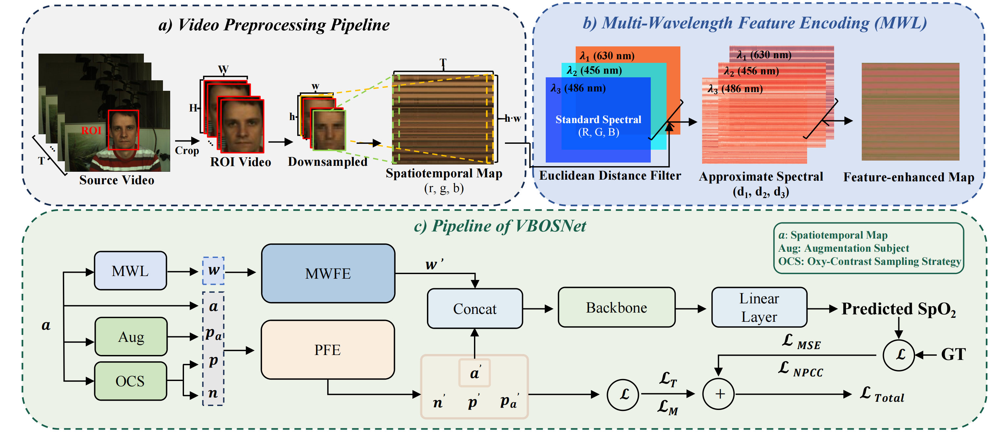

# VBOSNet
The dataset and code of **VBOSNet: A Contrastive Learning Framework for Video-Based SpO₂ Estimation in Multi-Scenario Environments**

⚠️  The complete code and datasets will be made available upon acceptance of the paper.

## Framework Overview

